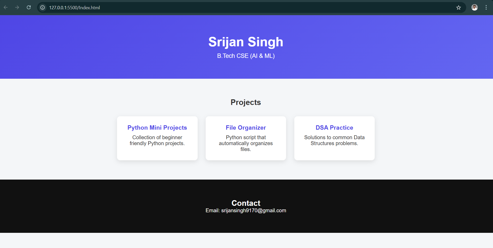

Personal Portfolio Website

Description

This is a simple personal portfolio website built using HTML and CSS.  
It showcases my projects, skills, and contact information.

Features

- Responsive layout
- Project cards with hover animations
- Clean modern design
- Simple and easy to customize

Technologies Used

- HTML
- CSS

Screenshot

Installation

1. Clone the repository

git clone https://github.com/srijansingh9170-source/portfolio-website.git

2. Open the folder

cd portfolio-website

3. Open index.html in your browser

Projects Included

- Python Mini Projects
- File Organizer Python Script
- DSA Practice Repository

Future Improvements

- Add JavaScript animations
- Add project links to GitHub
- Improve mobile responsiveness
- Deploy portfolio online

Author

Srijan Singh  
B.Tech CSE (AI & ML)